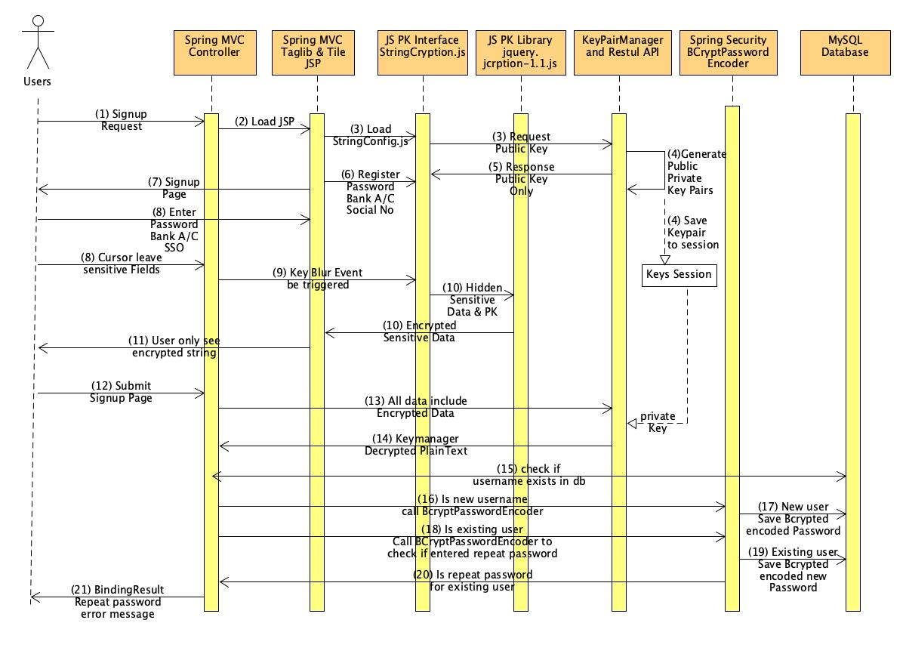
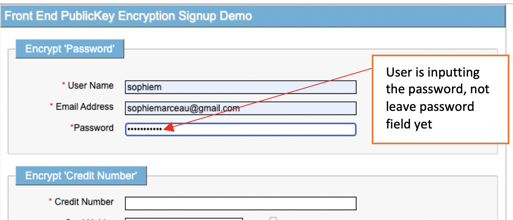

# Frontend Public Key Encryption of Password, Bank Account # and Social Security
##  _____________ A Secure Signup Solution Implementation and Demo _________________


## Overview

### Why and how do we apply frontend encryption ?
   
   Https (TLS) be able to encrypt internet channel to prevent the hackers from stealing sensitive data in network, however, 
   some invaded viruses, like Trojan Horse and Active-X, still are able to sneak into your local machine to steal the data
   by means of harmless links, misleading email,a falsified website, or a fake advertisement.
      
   They are using keylogger to make system call to log the keystroke, recording critical javascript variables or using 
   hugh Hash Strings of 'Rainbow table' to guess your hashed password sent be UI
      
   We attempt to hide the sensitive form field variables and when we complete enter sensitive field and leave focus from 
   the field, encrypt the data that you just entered, dynamically obtain pubic key from server to encrypt form field by 
   javascript. 


### Why do we use Public Key to encrypt sensitive data in frontend?
  
   First of all, some sensitive data such as BankAccount number and Social Security number must be decrypted in server 
   side for further business use. So apply public key cryptography to be able to decrypt those data to plain text in 
   Server side and encrypt the data in frontend before user submit the data form.
   
   Secondly, signup pages normally consist of first page for creating username and password and press 'Continue' to next
   pages , until getting 'Submit' page, sensitive information plain texts will stay for a while between pages, which 
   give the invaded virus a timing chance to steal them, on this mechinism, people leave those fields immediately encrypt
   to eliminate the chance for those viruses to steal the information

   Regarding of the password, some developers may use one time hash algorithm, such as SHA256 or MD5, to hash password 
   in UI and send to server save it to Database.
       
   This way leaves the room for "Rain Table" which holds Hugh Hashed Strings to brute force 'Guess' hashed password, we 
   use public key cryptography to be able to avoid this hash "Guess' because PublicKey-encrypted RSA String is different 
   from those Hashed String and even more complicated(1024, 2048 bytes etc). 
       
   On this mechanism, each time when a user loads the Signup page, the server will generate a new public key which is 
   different from previous public key as users loaded the same Signup page previously.
    
   Since Spring Boot 2.0, Spring Security uses BCryptPasswordEncoder to save salt hashed password, for the same password 
   plain text, this encoder generates a different encoded string, we save this encoded password string to the database. 
   Rain Table is hard to guess the changeable hashed password.
    
   The method: BCryptPasswordEncoder.matchers(passwordPlainText, database_saved_bcrypted_password) required passwordPlainText, 
   FEPKE mechanism encrypts password in the UI side and provide a decrypt method in server side to get password plain 
   text, then for the important password handling--password validation, we can validate wheather same user try to create the 
   same password as he/she already created !
    
   In order to take advantage of BCryptPasswordEncoder, We can not SHA256 ot MD5 hash passwords in UI and use public key 
   to solve this problem.
   

   
# Project Structure   
   
   
   
# Running Environment and Development Tools 

   JDK1.8
   
   SpringBoot 2.1.3.RELEASE   
 
   Intellij Community Verson
   
   Postman
   
   Any Browser
   
   Especially ensure to setup Intellij Project Structure to JDK 1.8 for key generator
  

# Dependencies

## Major Dependencies description
    
    org.bouncycastle.bcprov-jdk16.1.45  --- Generates Public Key Pair, Private Key Pair, descrypts FEPKEed data 
    to plain text
    
    Spring boot 2.1.3
    Spring boot Web                     --- Spring MVC for Demo 
    org.apache.tile.tiles-jsp.3.0.5     --- Support view header, menu, body and footer
    Spring boot Security                --- Apply BCryptPasswordEncoder for password saving and password  validation
    Spring boot JPA Data / MySQL        --- Signup data Model database access
    
    org.modelmapper.2.3.5               --- Model To Dto or Dto to Model conversion
    
    org.projectlombok                   
    
    
   
  ...  
  
       ..................
  
	<parent>
		<groupId>org.springframework.boot</groupId>
		<artifactId>spring-boot-starter-parent</artifactId>
		<version>2.1.3.RELEASE</version>
	</parent>

	<properties>
		<java.version>1.8</java.version>
		<spring-cloud.version>Greenwich.RELEASE</spring-cloud.version>
		<start-class>com.front.end.pk.encrypt.demo.FrontEndCryptionDemoApplication</start-class>
	</properties>
	<dependencies>

		<dependency>
			<groupId>org.bouncycastle</groupId>
			<artifactId>bcprov-jdk16</artifactId>
			<version>1.45</version>
		</dependency>
		<dependency>
			<groupId>org.springframework.boot</groupId>
			<artifactId>spring-boot-starter-web</artifactId>
		</dependency>
		<dependency>
			<groupId>org.springframework.boot</groupId>
			<artifactId>spring-boot-starter-security</artifactId>
		</dependency>
		<dependency>
			<groupId>org.springframework.boot</groupId>
			<artifactId>spring-boot-starter-data-jpa</artifactId>
		</dependency>

		<dependency>
			<groupId>org.projectlombok</groupId>
			<artifactId>lombok</artifactId>
			<optional>true</optional>
		</dependency>
		<dependency>
			<groupId>org.modelmapper</groupId>
			<artifactId>modelmapper</artifactId>
			<version>2.3.5</version>
		</dependency>
		<dependency>
			<groupId>mysql</groupId>
			<artifactId>mysql-connector-java</artifactId>
			<scope>runtime</scope>
		</dependency>
		<dependency>
			<groupId>org.apache.tiles</groupId>
			<artifactId>tiles-jsp</artifactId>
			<version>3.0.5</version>
		</dependency>


		.......

	</dependencies>
   
   ...

   
# Workflow Diagram

  
  
  ## We will explain each workflow arrow's function with sequence No. (1), (2),(3).....(21) by description, code and demo
  
 
  
  ## (1) - Signup Request 
     
      http://localhost:8080/FrontEndPublicKeyEncryption/signup
      
      FrontEndPublicKeyEncryption is defined as contextPath in application.properties
      
      server.servlet.contextPath=/FrontEndPublicKeyEncryption
      
      If apply Spring Security, run any web page popout its default login page, before Spring Boot 2.7.8, we can use 
      WebSecurityConfigurerAdapter disable default login page and allow /signup and /getKeypair.html to work without 
      authentication 
      
      
      ...
        
     @EnableWebSecurity
     @Configuration
     public class SecurityConfig extends WebSecurityConfigurerAdapter {

        @Override
        protected void configure(HttpSecurity http) throws Exception
        {
            http.csrf().disable()
            .authorizeRequests()
                  .antMatchers(
                          "/",
                          "/signup",
                          "/savePassword",
                        "/getKeyPair.html").permitAll()
                  .and().formLogin().disable();

         }
     }

      
      ...
      
      
      
  
  ## (2) Spring MVC Controller accept GET request and load signup page:
   
 ...
 
   	@RequestMapping(value="/signup",method = RequestMethod.GET)
	public ModelAndView signupForm(ModelAndView modelAndView)
			throws Exception {
		modelAndView.setViewName("FrontEndCryptionDemo");
		modelAndView.addObject("agentTableRequestDto",new AgentTableDto());
		/**
		 *  Return to tile definition name: AgentLogin defined in tiles.xml
		 */
		return modelAndView;
	}
	
 ...
 
  
  Here FrontEndCryptionDemo is Signup page handler points signup definition in tiles.xml, signup page body 
  code is FrontEndCryptionDemo.jsp, coming along with header.jsp and footer.jsp (see code source)

 ## (3) Before Load JSP HTML context, send Public Key request
   
   stringCryption.getPublicKey("/FrontEndPublicKeyEncryption/getKeyPair.html") send public key request to 
   keypairManager via Rest API see line 16 as below code
   
   
   
   StringCryption.js is interface between front end public key encryption library and view layer (jsp)
   
   We can find line 42 is method getKeyPair and line 51 is method public key encrypt in javascript literal class
   
   
  
## (4) KeyPairManager generates Public Key pair (e,n) and Private Key pair(d,n)

  ...

     package com.front.end.pk.encrypt.demo.fepke_api;

     import lombok.Data;
     import lombok.extern.slf4j.Slf4j;
     import java.security.KeyPair;

     @Slf4j
     @Data  
     public class KeyPairManager {

        private static KeyPairManager handler=null;	
        private KeyPair keyPair=null; 
        private String keyString=null;
        JCryptionUtil jCryptionUtil =null;
	
        public synchronized static KeyPairManager getInstance() {	
		if (null==handler) {
		    handler = new KeyPairManager();
		}
		return handler;
	}
	
	 /**
	  *  KeyPair structure: {e,n} is public key , {d,n} is private key, 
	  *  md=(p-1) x (q-1) , n=p x q, p and q must be prime number 
	  */
	  
			
        private KeyPairManager() {
		try {
			 jCryptionUtil = new JCryptionUtil();  	       
			 keyPair = jCryptionUtil.generateKeypair();  
			 StringBuffer output = new StringBuffer();  
			 String e = jCryptionUtil.getPublicKeyExponent(keyPair);  
			 String n = jCryptionUtil.getPublicKeyModulus(keyPair);  
			 String md = String.valueOf(jCryptionUtil.getMaxDigits());  		
			 output.append("{\"e\":\"");  
			 output.append(e);  
			 output.append("\",\"n\":\"");  
			 output.append(n);  
			 output.append("\",\"maxdigits\":\"");  
			 output.append(md);  
			 output.append("\"}");  
			 output.toString();  
			 keyString = output.toString().replaceAll("\r", "").replaceAll("\n", "").trim();  
		} catch (Exception e) {
			log.info("Generate Key Failed because of "+e.getMessage());
		}
	}

	public String decrypt(String encrypted) {
		String retVal = null;
		log.debug("encrypted String="+encrypted+"\n keyPair="+keyPair);
		try {
			retVal = jCryptionUtil.decrypt(encrypted, keyPair);
		} catch (Exception e) {
			log.info("Descryption Failed because of "+e.getMessage());
		}
		return retVal;
	 }
    }

  
  ...
  
  
   
  ## (5) An sample to explain Public Key RSA Cryptography 
  
  

  In above diagram, (e,n) is public key pair and (d,n) is private key pair, M is plainText, public key 
  encrypt is C=(M^e) mod n , private key decrypt is D = (C^d) mod n.  
  
  /FrontEndPublicKeyEncryption/getKeyPair.html will return (e,n) in asscii character format, this URL is 
  synchronized request
     
## (6) Register Password, Bank A/c and Social Security 
      
  	 	stringCryption.initialize("password"); 		  
		stringCryption.initialize("creditNumber"); 		  
		stringCryption.initialize("socialSecurity");
		
    I made stringCryption.js as an interface between JSP and Javascript public key encryption library: 
    jquery.jcryption-1.1.js, I also made some secure change this library.
    
#   Secure Consideration of Javascript
    
    We use fronten Public Key to encrypt sensitive data, maybe people ask when the pass sensitive data to 
    encrypt method into the library, we need variable to contain the data, using Chrome Inspect->Source or
    other debug way we can easily find sensitive data like password from that variable
    
    Thanks for JQuery provides $(ElementId).val() method, we can hide data from Javascript debug. We have
    piece of code StringCryption.js for key bur event, especially we separate elementId literal string variable 
    and id representive symbol "#" and cacatenated together 
    
    $("#"+elementId).val() , elementId variable may contain "password" , "banckAccountNo" etc
    
    Chrome "inspect"->"source" can not see such sensitive data any more
    
    
    
    
    
     
    
    
   
...
   var stringCryption_ = {   
       ........
     initialize: function (encryptField) {
		
      .......
	 $("#"+encryptField).blur(function(){
              if(!stringCryption_.isBlank($(this).val())) {
	              var encString =stringCryption_.encrypt(encryptField);
              }
	 }); 
	 
    }
...
    
    
    Inside of literal class stringCryption_ , we have encrypt method to call the library
...
	  encrypt: function(elementId) {
		  if (stringCryption_.isBlank(publicKey)) {
			  alert("Please call stringCryption.initialize() first or check if publicKey URL is correct, URL="+URL);
			  return null;
		  } 
	      // no sensitive value variables can be seen by chrome infect or other javascript dev tool
		  if (stringCryption_.isBlank($("#"+elementId).val())) {
			  return null;
		  }
		  $.jCryption.secure_encrypt(elementId, publicKey, function(encryptedValue) {

			 $("#"+elementId).val(encryptedValue);
			  var encDiv= document.getElementById(SHOW_ENC_STRING_ID);	         	
         	  if (null!=encDiv) {
         		  encDiv.style.display="block";
         		  encDiv.innerHTML="Encrypted String:\n"+encryptedValue;
         	  }
			  encryptedString = encryptedValue;
          });  
		  return encryptedString;
   }, 
...
 
    
    
    
## (7) Spring MVC return empty signup page and let user enter data

   
   
    We call loan agent sigup page, therefore we create AgentTableDto to accept user entered data and 
    cipherText data encrypted by Javascript as following code and also do server side data validation, 
    especially password
   
...

 public class AgentTableDto {

	@NotBlank(message = "Username is required")
	private String userName;
	@NotBlank(message="password is required")
	private String password;

	@Email(message = "Email is invalid", regexp = "[a-z0-9._%+-]+@[a-z0-9.-]+\\.[a-z]{2,3}")
	private String emailAddress;
	
	@NotBlank(message="CreditNumber is required")
	private String creditNumber;
	
	@NotBlank(message = "Credit Card Holder is required")
	private String cardHolderName;
	
	@NotBlank(message = "Expired Date is required")
	@DateTimeFormat(pattern = "mm/yy")
	private String expiringDate;
	
	@NotBlank(message = "Security Code is required")
	private String securityCode;
	
	@NotBlank(message = "Social Security Number is required")
	private String socialSecurity;
	@NotBlank(message = "SSO full name is required")
	private String fullName;

	private Boolean passwordMatched;

	private String message;
 }

...
 
 
    
  Create JPA Model class AgentTable to access MySQL database (see full source code from download)
  
  
  
  application.properties configure MySQL 
  ## spring.jpa.hibernate.ddl-auto = create if first time run this code
...

spring.datasource.driver-class-name=com.mysql.cj.jdbc.Driver
spring.datasource.url = jdbc:mysql://localhost:3306/agentdb
spring.datasource.username = root
spring.datasource.password = mypassword

 
spring.jpa.properties.hibernate.dialect = org.hibernate.dialect.MySQL5InnoDBDialect

 
spring.jpa.hibernate.ddl-auto =update
spring.jpa.generate-ddl=true
spring.jpa.show-sql = true

logging.level.org.hibernate.SQL=INFO
logging.level.org.hibernate.type=INFO

...
  
   
## (8) User enters data include password, bank account and social security 

### Below diagram show that the user type password and cursor is still in password field 
  
 
 
## (9) Key Blur Event be triggered
## (10) Javascript sends the password to jquery.jCryption.1.1.js to encrypt at frontend
## (11) JSP display the ciper text password to User
  (9) - (11) working result is:
  Once the user finished entering password and cursor is leave password field, the encrypt ciphertext be show

  


## (12) Entered all signup data and ready to submit, signup page looks like: 

  Now bank account and social security fields contain cipher text data too.
  
  
  
  Once user press "Submit' button, submitted data will be send to Spring MVC Controller by issuing form
  POST request
  
## (13) Spring MVC controller accept a POST request to following works
       
       check the validation error in BindResult, the @Valid annotation check the AgentTableDto vailidation
       condition such as @NotBlank
       @Emaul etc, once find any DTO validation Error , return modelAndViewError, wbich go back to original 
        sign up page which  ModelAndView("FrontEndCryptionDemo") specified
       
       
...

	@RequestMapping(value="/frontEndCryptionDemo.html",method = RequestMethod.POST)
	public ModelAndView processSubmit(
			@Valid @ModelAttribute("agentTableRequestDto") AgentTableDto agentTableRequestDto,
			BindingResult bindingResult,
			HttpServletRequest request
		)	throws Exception { 
		
		log.info("FrontEndCryptionDemoController prcessSubmit() begin");
		ModelAndView modelAndViewError =new ModelAndView("FrontEndCryptionDemo");
		ModelAndView modelAndViewDemo =new ModelAndView("redirect:frontEndCryptionDemoSubmitSuccess.html");

		if (bindingResult.hasErrors()) {
			return modelAndViewError;
		} else {

...
## Basic Validation based on DTO condition annatation and @Valid 

     
       
     
## (14)  Mapper DTO to Model and Decrypt the data  
       
         
...

	                /**
			 *  DTO Object -> Entity Object using ModelMapper
			 *  save a lot of boilerplate code
			 */
			AgentTable agentTableDao = modelMapper.map(agentTableRequestDto,AgentTable.class);
			AgentTableDemoDto agentTableDemoDto = modelMapper.map(agentTableRequestDto, AgentTableDemoDto.class);

			/**
			 *   Encrypt password , credit card number and social security number
			 *   by javascript code which sent to agentTableRequestDto
			 */
			String encryptedPassword =agentTableRequestDto.getPassword();
			String encryptedCreditCardNumber = agentTableRequestDto.getCreditNumber();
			String encryptedSocialSecurityNumber = agentTableRequestDto.getSocialSecurity();
			/**
			 *  Decrypt password , credit card number and social security number
			 *  by fepkeDecrpt method
			 */
			String passwordPlanText = encoderService.fepkeDecrpt(encryptedPassword);
			String creditCardNumberPlanText =  encoderService.fepkeDecrpt(encryptedCreditCardNumber);
			String socialSecurityNumberPlanText = encoderService.fepkeDecrpt(encryptedSocialSecurityNumber);

...


## (15) (21) Call AgentTableService to validate password deeply

## agentTableService.validatPasswordReturnExistAgentTable
   If validation failed , this service method will throw PasswordException, Spring MVC controller catch this exception 
   bindingResult.addError will be added exception message into BindResult.error, then go back to original signup page, 
   the Single Page Action(SPA) will handle error.
   Using this way we do not need @HandleException, @ControllerAdivce to handle exception and redirect error to different 
   error page

...

                    try {
				existAgentTable = agentTableService.validatPasswordReturnExistAgentTable(
				          agentTableRequestDto.getUserName(),
					  passwordPlanText);

			} catch (PasswordException ex) {
				bindingResult.addError(new FieldError("AgentTableRequestDto", "password",
						ex.getMessage()));
				return modelAndViewError;
			}
...

## (15) (16) (18) (20) check exist user and same user using repeated password by agentTableService, it does following works
## This is reason why we use BCryptPasswordEncoder.matches

    Verify if password length is 8 ~15 chars and then using BCryptPasswordEncoder.matches
    (plainText,bcryptString to validate if entered password matches saved bcrypted password
    to see if people entered same password for same user, if validation is passed , return
    exist entity to get primary key agentId, if it is invalided, handling bindingResult to
    ensure error message occurs in same signup webpage
...
 @Slf4j
 @Service
 public class AgentTableService {
    @Autowired
    AgentTableRepository agentTableRepository;

    @Autowired
    EncoderService encoderService;

    public AgentTable validatPasswordReturnExistAgentTable(
            String username, String passwordPlainText) throws PasswordException {

        if (passwordPlainText.length()<8 || passwordPlainText.length()>15) {
            throw new PasswordException("PasswordSize required 8 - 15 characters");
        }

        Optional<AgentTable> existAgentTableOpt = agentTableRepository.findAgentTableByUserName(username);

        AgentTable existAgentTable = null;
        if (existAgentTableOpt.isPresent()) {
            existAgentTable = existAgentTableOpt.get();
            String savedBcryptedpassword = existAgentTable.getPassword();
            boolean checkResult = encoderService.checkPasswordExist(passwordPlainText, savedBcryptedpassword);
            if (checkResult) {
                throw new PasswordException("Password: "+passwordPlainText+" exists for user: "+username);
            }
        }
        return existAgentTable;
     }
 }

...

# Here is existing user entered repeated password, signup page alert 

##  This is proof for FEPKE algorithm not only encript password at frontend but also verify if entered password valid !!

  

## (17) (19) If new user or existing user with new password, save BCryptPasswordEncoded Password to MySQL

...

                        /**
	                 *  if the record exists for this username, means this time update exist record
			 */
		       if (existAgentTable!=null) {
				agentTableDao.setAgentId(existAgentTable.getAgentId());
			}
			/**
			 * Save bcrypt encoded password to database by agentTableDao
			 */
			String bcryptedPassword= encoderService.bcryptEncodingPassword(passwordPlanText);

			agentTableDao.setPassword(bcryptedPassword);

			/**
			 *  save creditCardNumberPlainText and socialSecurityNumberPlanText to database
			 *  for further business use
			 */

			agentTableDao.setCreditNumber(creditCardNumberPlanText);
			agentTableDao.setSocialSecurity(socialSecurityNumberPlanText);

			/**
			 *  save to database
			 */
			agentTableRepository.save(agentTableDao);
				

...


## Getting Started

### Dependencies

* Describe any prerequisites, libraries, OS version, etc., needed before installing program.
* ex. Windows 10

### Installing

* How/where to download your program
* Any modifications needed to be made to files/folders

### Executing program

* How to run the program
* Step-by-step bullets
```
code blocks for commands
```
## Source code download
   https://github.com/johnzhang320/front-end-public-key-encryption
## Help

Any advise for common problems or issues.
```
command to run if program contains helper info
```

## Authors

Contributors names and contact info

ex. Dominique Pizzie  
ex. [@DomPizzie](https://twitter.com/dompizzie)

## Version History

* 0.2
    * Various bug fixes and optimizations
    * See [commit change]() or See [release history]()
* 0.1
    * Initial Release

## License

This project is licensed under the [NAME HERE] License - see the LICENSE.md file for details

## Acknowledgments

       
        


