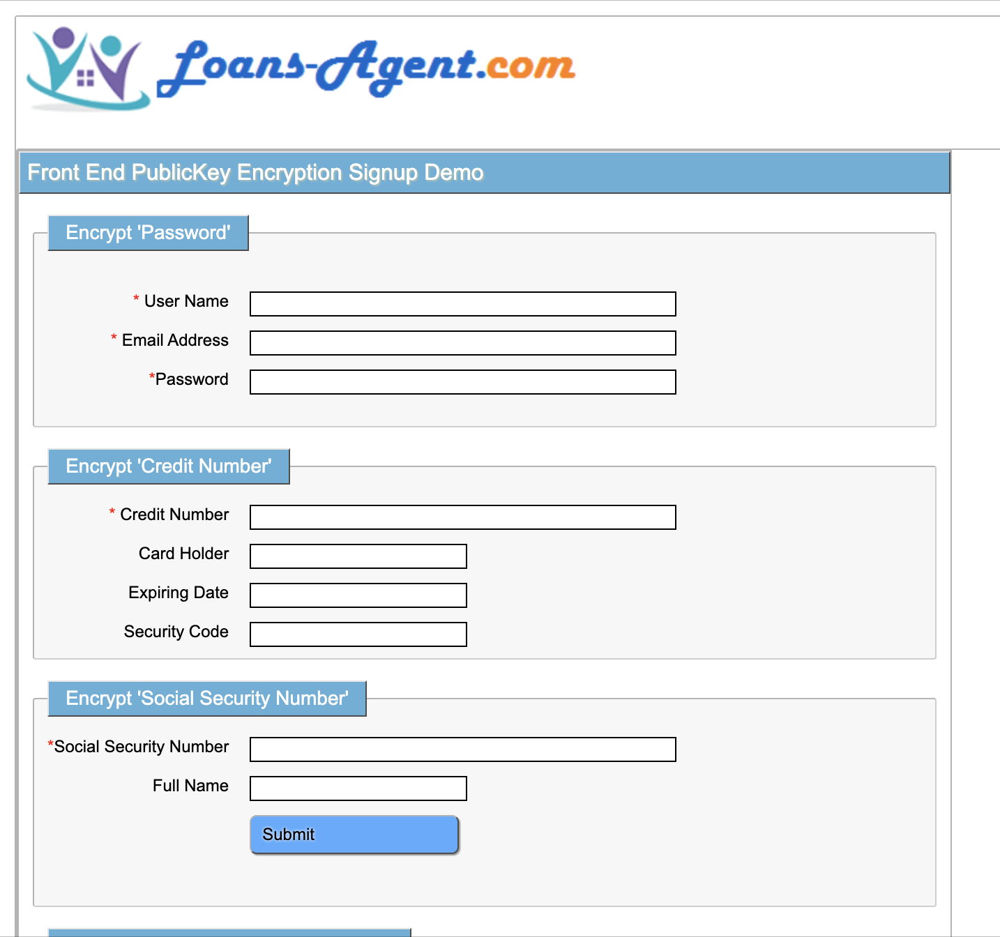

## Encrypting Password, Bank Account # and Social Security at Frontend by Dynamic PublicKey

## Overview

### Why do we apply frontend encryption ?
   
   Although applying Https be able prevent the hackers from stealing sensitive information over network, some invaded virus, 
   like Trojan Horse and Active-X, are able to sneak into your local machine to steal the information through harmless links, 
   misleading email,a falsified website, or a fake advertisement.
      
   They are using keylogger to make system call to log the keystroke and record critical javascript variable, using 
   Rainbow table guess your hashed password in UI
      
   We attempt to hide the sensitive form field variables and when we complete enter sensitive field and leave focus from 
   the field, encrypt the data that you just entered, dynamically obtain pubic key from server to encrypt form field by 
   javascript. 


### Why do we use Public Key to encrypt sensitive information ?
  
   The sensitive data such as BankAccount Number and Social Security number must be decrypted in server side for 
   further use, normally signup pages consist of first page for creating username and password and press 'Continue' to next
   pages , until getting 'Submit' page, sensitive information plain texts will stay for a while between pages, which 
   give the invaded virus timing chance to steal them, on this mechinism, people leave those fields immediately encrypt
   to eliminate the chance those viruses stealing the information

   Regarding of the password, some developers may use one time hash algorithm, such as SHA256 or MD5, to hash password 
   in UI and send to server save it to Database.
       
   This way leaves the room for "Rain Table" which holds Hugh Hashed Strings to brute force 'Guess' hashed password, we 
   use public key cryptography to be able to avoid this hash "Guess' because PublicKey-encrypted RSA String is different 
   from Hashed String and even more complicated(1024, 2048 bytes etc). 
       
   On this mechanism, each time when a user loads the Signup page, the server will generate a new public key which is 
   different from previous public key as users loaded the same Signup page previously.
    
   Since Spring Boot 2.0, Spring Security uses BCryptPasswordEncoder to save salt hashed password, for the same password 
   plain text, this encoder generates a different encoded string, we save this encoded password string to the database. 
   Rain Table is delimaly to guess changeable hashed password.
    
   But BCryptPasswordEncoder.matched(passwordPlainText, database_saved_bcrypted_password) required passwordPlainText, 
   FEPKE mechanism encrypts password in the UI side and provide a decrypt method in server side to get password plain 
   text, then we can validate if same username to use the same password. 
    
   In order to take advantage of BCryptPasswordEncoder, We can not SHA256 ot MD5 hash passwords in UI and use public key 
   to solve this problem.
   

   
## Project Structure   
   
   
## Running Environment and Development Tools 

   JDK1.8
   
   SpringBoot 2.1.3.RELEASE   
 
   Intellij Community Verson
   
   Postman
   
   Any Browser

## Dependancy
   
  ...  
  
       ..................
  
	<parent>
		<groupId>org.springframework.boot</groupId>
		<artifactId>spring-boot-starter-parent</artifactId>
		<version>2.1.3.RELEASE</version>
	</parent>

	<properties>
		<java.version>1.8</java.version>
		<spring-cloud.version>Greenwich.RELEASE</spring-cloud.version>
		<start-class>com.front.end.pk.encrypt.demo.FrontEndCryptionDemoApplication</start-class>
	</properties>
	<dependencies>

		<dependency>
			<groupId>org.bouncycastle</groupId>
			<artifactId>bcprov-jdk16</artifactId>
			<version>1.45</version>
		</dependency>
		<dependency>
			<groupId>org.springframework.boot</groupId>
			<artifactId>spring-boot-starter-web</artifactId>
		</dependency>
		<dependency>
			<groupId>org.springframework.boot</groupId>
			<artifactId>spring-boot-starter-security</artifactId>
		</dependency>
		<dependency>
			<groupId>org.springframework.boot</groupId>
			<artifactId>spring-boot-starter-data-jpa</artifactId>
		</dependency>

		<dependency>
			<groupId>org.projectlombok</groupId>
			<artifactId>lombok</artifactId>
			<optional>true</optional>
		</dependency>
		<dependency>
			<groupId>org.modelmapper</groupId>
			<artifactId>modelmapper</artifactId>
			<version>2.3.5</version>
		</dependency>
		<dependency>
			<groupId>mysql</groupId>
			<artifactId>mysql-connector-java</artifactId>
			<scope>runtime</scope>
		</dependency>
		<dependency>
			<groupId>org.apache.tiles</groupId>
			<artifactId>tiles-jsp</artifactId>
			<version>3.0.5</version>
		</dependency>


		.......

	</dependencies>
   
   ...

   
## Workflow 

  
  
  ### Based on workflow, explain each process using code and demo screen as following
  
  
  
  ### User sends the request to Spring MVC Controller  
  
  First of all the user requests a signup, then springboot MVC controller 'GET' this request, return signup page as following code
   
 ...
 
   	@RequestMapping(value="/signup",method = RequestMethod.GET)
	public ModelAndView signupForm(ModelAndView modelAndView)
			throws Exception {
		modelAndView.setViewName("FrontEndCryptionDemo");
		modelAndView.addObject("agentTableRequestDto",new AgentTableDto());
		/**
		 *  Return to tile definition name: AgentLogin defined in tiles.xml
		 */
		return modelAndView;
	}
	
 ...
 
  
  Here FrontEndCryptionDemo is Signup page handler points tiles.xml body definition, which will call signup page: FrontEndCryptionDemo.jsp 
  conbined with header.jsp and footer.jsp
  
  FrontEndCryptionDemo.jsp as signup page, displays as following: 
  
  
  
  
  
  
 
 
 ### JS Request PublicKey and Register Sensitive Fields
  
  ...
  
     <script type="text/javascript" src="js/lib/jquery-1.8.0.js"></script>
     <script type="text/javascript" src="js/lib/jquery.jcryption-1.1.js"></script> 
     
       <!-- Front End Encryption Customized Code -->
     <script type="text/javascript"	src="js/utils/stringCryption.js">		
     </script>
       <script type="text/javascript"> 
	  $(document).ready(function(){
		stringCryption.getPublicKey("/FrontEndPublicKeyEncryption/getKeyPair.html")
	 	stringCryption.initialize("password"); 		  
		stringCryption.initialize("creditNumber"); 		  
		stringCryption.initialize("socialSecurity");
	  }); 
  </script>  
  
  ...
  
  
  Here stringCryption.getPublicKey("/FrontEndPublicKeyEncryption/getKeyPair.html") sends PublicKey request to Rest API server  
  I coded stringCryption.js as interface between HTML or JSP page and Public Key Encryption Library query.jcryption-1.1.js, I also
  made some interface change in this library
  
  
  
  
  ## KeyPairManager generates public key and also does descryption
   
  
  ...
  

     package com.front.end.pk.encrypt.demo.fepke_api;

     import lombok.Data;
     import lombok.extern.slf4j.Slf4j;
     import java.security.KeyPair;

     @Slf4j
     @Data  
     public class KeyPairManager {

        private static KeyPairManager handler=null;	
        private KeyPair keyPair=null; 
        private String keyString=null;
        JCryptionUtil jCryptionUtil =null;
	
        public synchronized static KeyPairManager getInstance() {	
		if (null==handler) {
		    handler = new KeyPairManager();
		}
		return handler;
	}
	
	 /**
	  *  KeyPair structure: {e,n} is public key , {d,n} is private key, 
	  *  md=(p-1) x (q-1) , n=p x q, p and q must be prime number 
	  */
	  
			
        private KeyPairManager() {
		try {
			 jCryptionUtil = new JCryptionUtil();  	       
			 keyPair = jCryptionUtil.generateKeypair();  
			 StringBuffer output = new StringBuffer();  
			 String e = jCryptionUtil.getPublicKeyExponent(keyPair);  
			 String n = jCryptionUtil.getPublicKeyModulus(keyPair);  
			 String md = String.valueOf(jCryptionUtil.getMaxDigits());  		
			 output.append("{\"e\":\"");  
			 output.append(e);  
			 output.append("\",\"n\":\"");  
			 output.append(n);  
			 output.append("\",\"maxdigits\":\"");  
			 output.append(md);  
			 output.append("\"}");  
			 output.toString();  
			 keyString = output.toString().replaceAll("\r", "").replaceAll("\n", "").trim();  
		} catch (Exception e) {
			log.info("Generate Key Failed because of "+e.getMessage());
		}
	}

	public String decrypt(String encrypted) {
		String retVal = null;
		log.debug("encrypted String="+encrypted+"\n keyPair="+keyPair);
		try {
			retVal = jCryptionUtil.decrypt(encrypted, keyPair);
		} catch (Exception e) {
			log.info("Descryption Failed because of "+e.getMessage());
		}
		return retVal;
	 }
    }

  
  ...
  
  
  publickey pair (e,n) and model number md , which will be sent back to StringCryption.js

  ### 

     
 

## Getting Started

### Dependencies

* Describe any prerequisites, libraries, OS version, etc., needed before installing program.
* ex. Windows 10

### Installing

* How/where to download your program
* Any modifications needed to be made to files/folders

### Executing program

* How to run the program
* Step-by-step bullets
```
code blocks for commands
```
## Source code download
   https://github.com/johnzhang320/front-end-public-key-encryption
## Help

Any advise for common problems or issues.
```
command to run if program contains helper info
```

## Authors

Contributors names and contact info

ex. Dominique Pizzie  
ex. [@DomPizzie](https://twitter.com/dompizzie)

## Version History

* 0.2
    * Various bug fixes and optimizations
    * See [commit change]() or See [release history]()
* 0.1
    * Initial Release

## License

This project is licensed under the [NAME HERE] License - see the LICENSE.md file for details

## Acknowledgments

       
        


